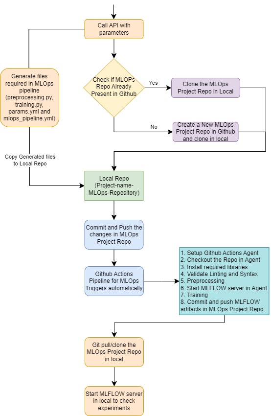

#### mlflow server command -
mlflow server --backend-store-uri sqlite:///mlflow.db --default-artifact-root ./artifacts --host 127.0.0.1 -p 1234

#### Prepeocessing
python src/preprocess_script.py --config=params.yml --input_csv=data/source/ticket_type.csv  --training_columns=short_desc --target_column=ticket_type

#### Training
python src/training.py --config=params.yml --input_csv=data/source/ticket_type.csv  --training_columns=short_desc --target_column=ticket_type --model_path=saved_models/model.joblib --train_size=0.888

#### Flow Diagram

This is Reference Reposotory where the mlflow data from mlflow.db is updated in Opensearch.